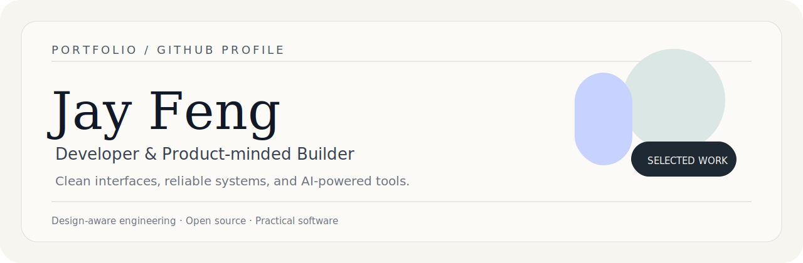
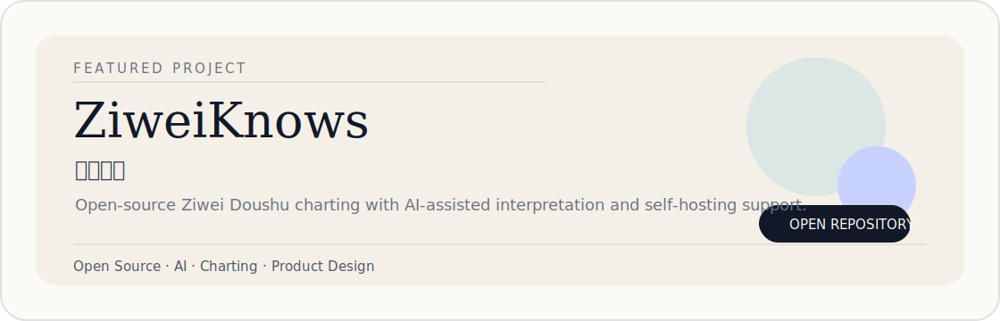

  

 

### Developer & Product-minded Builder

I design and build clean web experiences, reliable backend systems, and AI-powered tools with a focus on clarity, maintainability, and useful interaction.

[Project](#featured-project) · [Stack](#stack) · [Links](#links) · [Contact](mailto:fz.dev@foxmail.com)

---

## Featured Project

  

## Stack

  
  
  
  
  
  

## Links

  
  
  
  

## Contribution

