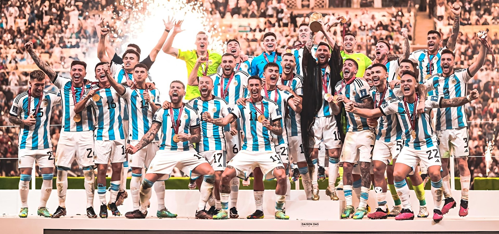

<!--
  ruijayfeng GitHub Profile — v5
  Style: Football banner top + Clean minimal + No terminal hero + No activity graph
  Teams: FC Barcelona (Blaugrana) + Argentina (Albiceleste)
  Language: ALL English
-->

<!-- ═══════════════════════ FOOTBALL BANNER ═══════════════════════ -->

  

<h3 align="center">Jay Feng · Xi'an</h3>

  Code · Product · Divination · AI 
  Building <a href="https://github.com/ziweiknows/ziwei-chart"><b>ZiWei</b></a> AI tools &amp; beyond · FCB · Argentina 🇦🇷

  
  
  
  
  

  Visca el Barça! · Vamos Argentina! &nbsp;
  

---

## 🛠️ Tech Stack

  

---

## 📊 GitHub Stats

<b>📈 Expand stats</b>

  
  

  

  
  
  

---

## 🐍 Contribution Snake

  <picture>
    <source media="(prefers-color-scheme: dark)" srcset="https://raw.githubusercontent.com/ruijayfeng/ruijayfeng/output/github-contribution-grid-snake-dark.svg">
    
  </picture>

---

## 📫 Get in touch

  <a href="https://fengzhe.site">🌐 fengzhe.site</a> &nbsp;·&nbsp;
  <a href="https://x.com/ruizhefeng">🐦 @ruizhefeng</a> &nbsp;·&nbsp;
  <a href="https://blog.csdn.net/SDFsoul">📝 CSDN Blog</a> &nbsp;·&nbsp;
  <a href="mailto:fz.dev@foxmail.com">💬 fz.dev@foxmail.com</a>

 

 

 
Made with ❤️ and a lot of ☕ · Força Barça! · Vamos Argentina!

