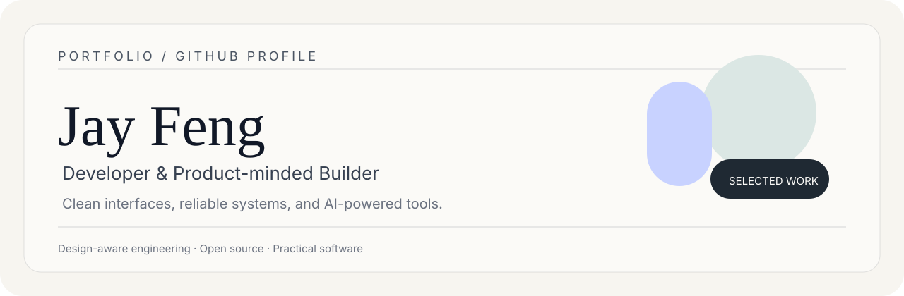

<!--
  ruijayfeng 精致版 Profile README（v2）
  设计原则：克制 / 留白 / 统一 tokyonight 配色 / 原创 banner / repo pin 卡片 / 折叠 stats
  配色：主蓝 #7AA2F7 · 深底 #1A1B26 · 文字 #C0CAF5
  注意：stats / pin / snake 均依赖公开数据，提交后显示真实内容
-->

<!-- HERO：保留你原创的 banner-hero.svg，不抢戏 -->

  

<h3 align="center">开发者 · 产品思维构建者 · 西安</h3>

  Code &nbsp;<b>·</b>&nbsp; Product &nbsp;<b>·</b>&nbsp; Divination &nbsp;<b>·</b>&nbsp; AI 
  写代码、做产品，也把传统命理和 AI 揉在一起玩。

  
  
  
  
  
  

---

## ✦ 关于我

<table>
  <tr>
    <td width="33%" valign="top">

**🔮 Divination**
紫微斗数爱好者，主理开源排盘项目 **ziwei**，把传统命理和 AI 解读揉在一起。

    </td>
    <td width="33%" valign="top">

**🤖 AI &amp; Product**
做过中文 AI 文字 GalGame 技能、写作去 AI 味工具，喜欢把模型变成能用的产品。

    </td>
    <td width="33%" valign="top">

**💻 Code**
全栈 + 系统方向，写过 C++ 并发内存池，也玩 MATLAB 量化研究面板。

    </td>
  </tr>
</table>

---

## ★ 招牌项目 · Featured

---

## ⚒ 技术栈 · Stack

  

---

## 📊 GitHub 数据

  
<b>点击展开 / 收起 数据卡片</b>

   

  

    
    
  

---

## 🐍 贡献贪吃蛇

  <picture>
    <source media="(prefers-color-scheme: dark)" srcset="https://raw.githubusercontent.com/ruijayfeng/ruijayfeng/output/github-contribution-grid-snake-dark.svg"/>
    <source media="(prefers-color-scheme: light)" srcset="https://raw.githubusercontent.com/ruijayfeng/ruijayfeng/output/github-contribution-grid-snake.svg"/>
    
  </picture>

---

## 📫 联系我

  🌐 <a href="https://fengzhe.site">fengzhe.site</a>
  &nbsp;·&nbsp; 🐦 <a href="https://x.com/ruizhefeng">@ruizhefeng</a>
  &nbsp;·&nbsp; 📝 <a href="https://blog.csdn.net/SDFsoul">CSDN</a>
  &nbsp;·&nbsp; 💬 <a href="mailto:fz.dev@foxmail.com">fz.dev@foxmail.com</a>

---

  

