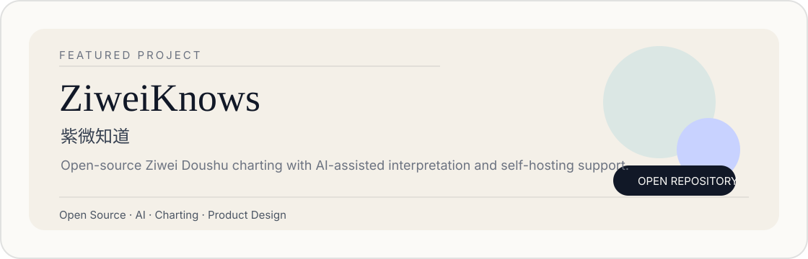

<!--
  ruijayfeng GitHub Profile — v4 Final
  Style: Terminal hero + Single football banner top + Clean cards + No activity graph
  Teams: FC Barcelona (Blaugrana) + Argentina (Albiceleste)
  Language: ALL English
-->

<!-- ═══════════════════════ FOOTBALL BANNER ═══════════════════════ -->

  

  <b>Visca el Barça!</b> &nbsp;·&nbsp; Blaugrana &amp; Albiceleste &nbsp;·&nbsp; Força Barça! · Vamos Argentina!

---

<!-- ═══════════════════════ TERMINAL HERO ═══════════════════════ -->

<pre>
<code>
jay@divination:~$ whoami

<b>Jay Feng</b> — Code | Product | Divination | AI
Based in Xi'an · Building <a href="https://github.com/ziweiknows/ziwei-chart">ZiWei</a> AI tools &amp; beyond

$ cat interests.txt
├─ 🔮 Divination  → Zi Wei Dou Shu + LLM interpretation
├─ 💻 Code        → C++ / JS / Python / Vue / TypeScript
├─ 🏗️ Product     → From idea to shipped
├─ ⚽ Football    → FCB · Argentina 🇦🇷
└─ ☕ Coffee      → Always brewing
</code>
</pre>

<!-- Social links -->

  
  
  
  
  

---

## ✨ Featured Projects

<table>
  <tr>
    <td width="50%">
      
    </td>
    <td width="50%">
      <h3>ZiWei Knows</h3>
      
Open-source Zi Wei Dou Shu AI chart reader — my signature project. 
      Merging traditional Chinese divination with modern LLM interpretation.

       
      
       Chinese AI text-based GalGame agent skill (top starred)
    </td>
  </tr>
  <tr>
    <td width="50%">
      <h3>zh-writing-humanizer</h3>
      
Remove AI-scent from Chinese writing. Make machine text feel human again.

    </td>
    <td width="50%">
      <h3>matlab-agentic-research-dashboard</h3>
      
Quantitative research dashboard powered by MATLAB + DeepSeek agents.

    </td>
  </tr>
</table>

---

## 🛠️ Tech Stack

  

---

## 📊 GitHub Stats

<b>📈 Expand stats</b>

  
  

  

  

---

## 🐍 Contribution Snake

  <picture>
    <source media="(prefers-color-scheme: dark)" srcset="https://raw.githubusercontent.com/ruijayfeng/ruijayfeng/output/github-contribution-grid-snake-dark.svg">
    
  </picture>

---

## 📫 Get in touch

  <a href="https://fengzhe.site">🌐 fengzhe.site</a> &nbsp;·&nbsp;
  <a href="https://x.com/ruizhefeng">🐦 @ruizhefeng</a> &nbsp;·&nbsp;
  <a href="https://blog.csdn.net/SDFsoul">📝 CSDN Blog</a> &nbsp;·&nbsp;
  <a href="mailto:fz.dev@foxmail.com">💬 fz.dev@foxmail.com</a>

 

 

 
Made with ❤️ and a lot of ☕ · Força Barça! · Vamos Argentina!

